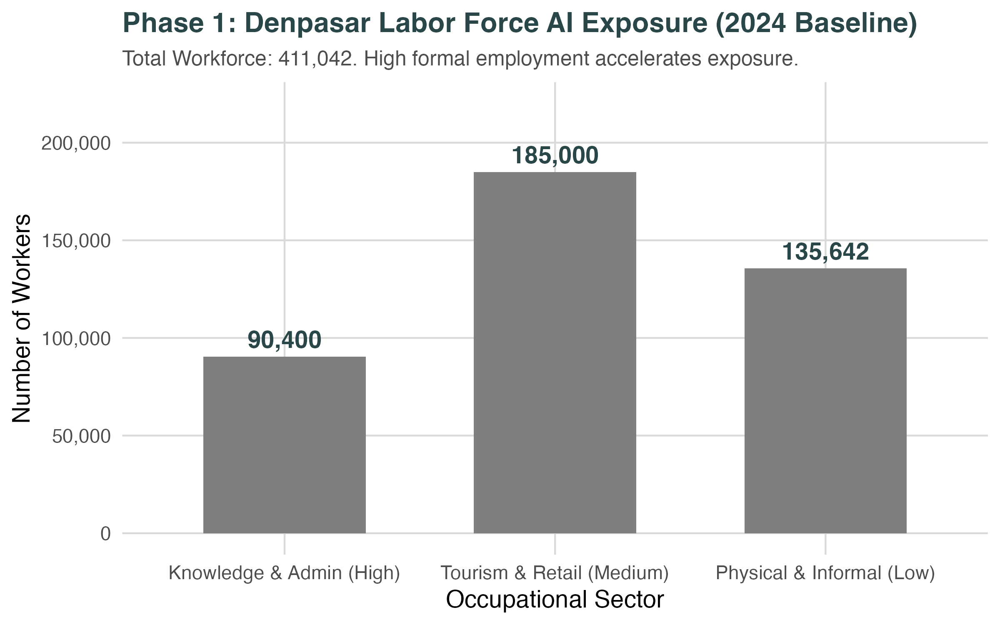

# **Will AI Make Denpasar Richer, or Just More Unequal? A 2050 Forecast**

*By Ricardo Ochoa and Socorro Román (CAPSUS)*

When you think of Denpasar, you probably picture the bustling gateway to Bali's world-famous tourism. You might not picture it as ground zero for an Artificial Intelligence revolution.

But according to our latest macroeconomic projections at CAPSUS, Denpasar is hurtling toward a massive technological shift. By 2050, the structural integration of AI and automation could inject a staggering **60 Trillion Rupiah "AI Dividend"** into the local economy.

However, this windfall comes with a severe warning label. Without aggressive intervention, AI threatens to tear the city’s labor market in two, triggering unprecedented wage inequality.

Here is what the data tells us about Denpasar’s trajectory over the next 25 years.

## **Why Denpasar? The Perfect AI Storm**

You might assume that AI will hit major global financial hubs first. While true, Denpasar is uniquely vulnerable—and uniquely positioned to benefit—compared to the rest of Indonesia.

To understand why, we mapped Denpasar's economic baseline using the latest 2024-2025 data from Statistics Indonesia (BPS). Two things stood out:

1. **High Formalization:** A massive 61.8% of Denpasar's 411,042 workers are formally employed, heavily concentrated in Services, Education, and Administration. AI targets formal, structured data environments.  
2. **Hyper-Connectivity:** Denpasar boasts near-universal 4G/5G connectivity across all its wards, erasing the "infrastructure friction" that slows down tech adoption in other municipalities.

Because of this, AI isn't just coming to Denpasar; it's going to arrive *fast*.

*Figure 1:* Denpasar's workforce categorized by AI exposure risk based on 2024 BPS data.
<!-- -->

## **Who Gets Replaced, Who Gets Upgraded, and Who Gets Left Behind?**

AI doesn't replace entire jobs; it replaces *tasks*. By breaking down the daily tasks of Denpasar’s labor force, our models grouped workers into three distinct futures.

The animation below illustrates how quickly AI tasks will integrate into these three tiers over time. Notice how local infrastructure accelerators (like Denpasar's blanket 5G coverage) shift the adoption tipping point earlier for knowledge and tourism workers, while physical laborers remain unimpacted by digital acceleration.

*Figure 2:* Animated S-Curve models showing how local digital infrastructure accelerates AI task integration.
<!-- -->

### **1\. The "Displacement Risk" Tier (\~90,400 Workers)**

**Who they are:** Knowledge workers, government administrators, and routine office staff.

**The AI Effect:** These roles deal heavily with data processing, standard inquiries, and routine cognitive tasks—exactly what Generative AI does best. Driven by provincial digital-identity pilots, these workers face the steepest "S-Curve" of adoption. Without serious upskilling, many of these roles will be automated out of existence by the late 2030s.

### **2\. The "Augmented" Tier (\~185,000 Workers)**

**Who they are:** The engine of Denpasar—Tourism, Hospitality, and Retail workers.

**The AI Effect:** AI can't smile, make a bed, or curate a deeply empathetic cultural experience. Therefore, AI won't replace these workers; it will *supercharge* them. They will use AI for backend logistics, personalized tourist itineraries, and dynamic pricing. Their productivity will skyrocket.

### **3\. The "Shielded but Stagnant" Tier (\~135,600 Workers)**

**Who they are:** Informal street vendors, manual construction workers, and physical laborers.

**The AI Effect:** Current robotics are too expensive to replace a street food vendor or a manual laborer in Bali. These workers are "shielded" from being fired by an algorithm. But as we'll see, being shielded from AI doesn't mean you're shielded from the economic fallout.

## **The 60-Trillion Rupiah Jackpot**

If Denpasar successfully integrates AI across its business sectors (our "High Transformation" scenario), the macroeconomic gains are staggering.

Currently, Denpasar’s Gross Regional Domestic Product (GRDP) sits at roughly 38 Trillion IDR. Based on historical trends without AI, it would slowly grow to about 135 Trillion IDR by 2050\.

The animated projection below demonstrates these diverging economic trajectories. Notice how the 'High Transformation' scenarios pull significantly ahead of the baseline around the early 2030s: **GRDP could surge to 205 Trillion IDR by 2050**. That extra wealth is the "AI Dividend"—a massive injection driven by the hyper-productivity of the "Augmented" workforce.

*Figure 3: Animated projection of Denpasar's GRDP across different macroeconomic and policy scenarios.*
<!-- -->

Furthermore, this wealth will physically reshape the city. As routine administrative tasks are automated, the demand for giant centralized office buildings will shrink. Instead, expect to see decentralized, highly connected "co-working nodes" for human-AI teams spreading outward toward the Badung Regency borders.

## **The Dark Side: The Great Wage Divide**

If Denpasar is getting richer, what’s the problem? **Distribution.**

AI is a wedge that will ruthlessly divide the formal and informal economies. As the 185,000 "Augmented" workers in tourism and retail become hyper-productive, their wages will rise to match. Meanwhile, the 135,600 "Shielded" informal workers will see no such productivity boost. Their wages will flatline.

Our animated models show that without government intervention, the wage inequality index between the formal and informal sectors will spike severely between 2035 and 2045\. As the animation below shifts from the 'No Policy' to the 'With Policy' scenario, watch how aggressive intervention successfully flattens this dangerous curve.

*Figure 4:* Animated wage inequality index. The city becomes richer on paper, but vastly more unequal on the streets without structural policy intervention.
<!-- -->

## **The Choice for 2050**

Denpasar is standing at a crossroads. The transition from a traditional tourism hub to an AI-augmented "Golden Indonesia" municipality is not automatic.

To capture the massive projected economy *without* tearing the social fabric apart, municipal leaders must act now. The solution isn't to ban AI—that would lead to regional stagnation. The solution is **aggressive, universal digital upskilling**, particularly programs that help micro and informal enterprises access AI tools.

If Denpasar can teach its entire workforce to ride the wave rather than be swept away by it, 2050 won't just be prosperous—it will be inclusive.

*Data sourced from BPS-Statistics Indonesia (2024-2025) and analyzed using CAPSUS Macro-Spatial Projection Models.*